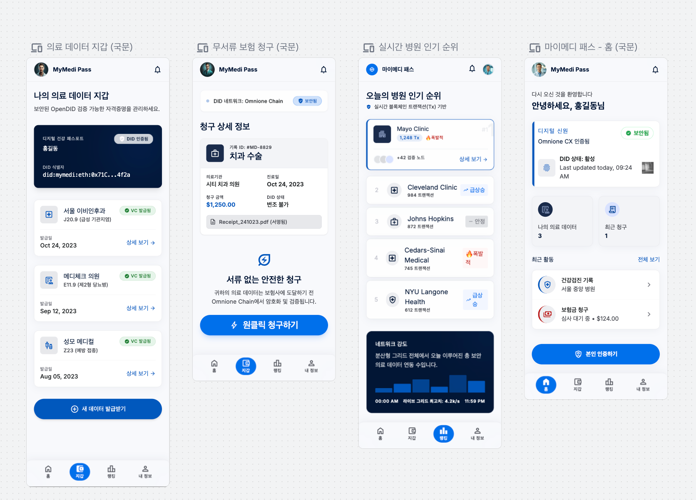
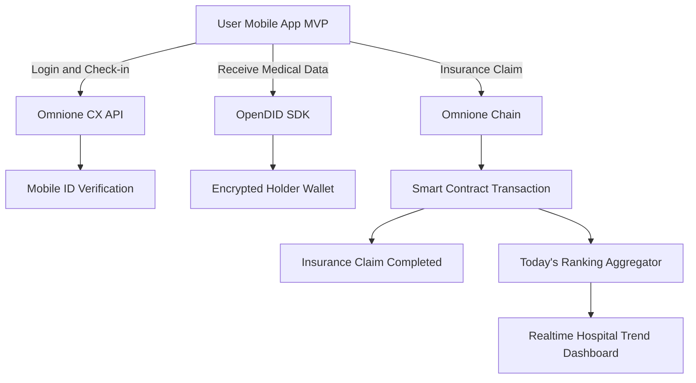

# 마이메디 패스 (MyMedi Pass)

> 모바일 신분증과 탈중앙화 DID 기반의 개인 주도형 의료 데이터 플랫폼  
> 2026 블록체인 & AI 해커톤 | Track 2: MVP 모델 개발 및 시연 부문

[Live Demo 바로가기](https://guhakim.github.io/MyMedi-Pass/) | [GitHub Repository](https://github.com/guhakim/MyMedi-Pass)

---

## 프로젝트 개요

**마이메디 패스(MyMedi Pass)**는 환자가 여러 병원에 분산된 진료 기록, 처방전, 소견서, 영수증 등 민감한 의료 데이터를 중앙 서버가 아닌 **본인의 스마트폰 지갑에서 직접 소유하고 통제**할 수 있도록 설계한 탈중앙화 헬스케어 플랫폼입니다.

정부 모바일 신분증 기반 신원 인증, OpenDID 기반 의료 데이터 지갑, Omnione Chain 기반 보험 청구 트랜잭션을 연결해 **서류 없는 원스톱 실손보험 청구 경험**을 제공합니다. 또한 실제 진료 트랜잭션을 기반으로 조작이 어려운 병원 트렌드 정보인 **Today's Ranking**을 제공합니다.

---

## MVP 모바일 인터페이스

마이메디 패스 MVP의 핵심 모바일 인터페이스는 백엔드 시뮬레이터의 3단계 프로세스와 실시간 랭킹 기능을 사용자가 직관적으로 이해할 수 있도록 설계했습니다. 전체 화면은 의료 서비스의 신뢰감과 블록체인 기반 보안 이미지를 함께 전달하는 **Clinical Integrity System** 디자인 방향을 따릅니다.

| 화면 | 설계 의도 |
| --- | --- |
| 홈 | `Omnione CX` 인증 상태를 가장 먼저 보여주고, 정부 모바일 신분증 연동 상태를 `SECURE` 배지로 시각화합니다. |
| 의료 데이터 지갑 | `OpenDID` 기반 의료 자격증명(VC)을 카드 리스트로 관리하며, 환자 중심 데이터 주권을 강조합니다. |
| 무서류 보험 청구 | `One-Click Claim` 흐름으로 `Omnione Chain` 스마트 컨트랙트 기반 청구 과정을 단순화합니다. |
| 실시간 병원 인기세 | 블록체인 트랜잭션 수(`Tx`)를 기반으로 조작이 어려운 병원 순위와 트렌드를 제공합니다. |

### 실행 방법

이 레포지토리는 별도 설치 없이 실행 가능한 모바일 MVP 웹앱을 포함합니다.

1. [Live Demo](https://guhakim.github.io/MyMedi-Pass/)에 접속하거나 `index.html` 파일을 브라우저에서 엽니다.
2. 하단 탭에서 `홈`, `지갑`, `청구`, `랭킹` 화면을 전환합니다.
3. `청구` 화면의 `원클릭 청구하기` 버튼을 누르면 Omnione Chain 트랜잭션 생성 흐름이 시뮬레이션됩니다.

---

## 제안 배경

1. **아날로그 의료 행정의 비효율성**  
   과거 진료 이력 확인, 타 병원 서류 이관, 실손보험 청구를 위해 환자가 병원을 직접 방문하고 종이 서류를 발급받아야 하는 불편이 남아 있습니다.

2. **디지털 보험 청구의 아날로그 모순**  
   모바일 보험 청구 과정에서도 병원 창구에서 종이 영수증을 출력한 뒤 스마트폰으로 촬영해 업로드하는 비효율이 반복되고 있습니다.

3. **신뢰하기 어려운 병원 리뷰와 평점**  
   기존 리뷰 시스템은 마케팅성 후기, 허위 리뷰, 조작 가능성에서 자유롭지 않아 환자가 실제 방문 기반의 신뢰 가능한 정보를 얻기 어렵습니다.

---

## 핵심 기능

### 1. 모바일 신분증 기반 간편 환자 접수

- `Omnione CX` 기반 인증 흐름으로 앱 로그인 및 병원 현장 접수 시 신원 검증을 수행합니다.
- 주민등록번호 수기 입력이나 플라스틱 진료 카드 없이 안전하고 빠른 접수 경험을 제공합니다.

### 2. 마이 의료 데이터 지갑

- 병원(Issuer)이 진료 종료 후 진료 기록과 영수증을 탈중앙화 자격증명(VC) 형태로 발급합니다.
- 환자(Holder)는 본인 스마트폰 지갑에 의료 데이터를 보관하고, 필요한 기관(Verifier)에만 선택적으로 제출할 수 있습니다.

### 3. 무서류 원스톱 보험 청구

- 앱에서 보험 청구를 실행하면 `Omnione Chain` 기반 스마트 컨트랙트 흐름이 동작합니다.
- 암호화된 진료 데이터와 청구 이력이 위변조 방지 트랜잭션으로 기록됩니다.

### 4. Today's Ranking

- 광고, 허위 리뷰, 단순 클릭 수가 아닌 **실제 모바일 신분증 접수 및 진료 트랜잭션 빈도**를 기반으로 병원 순위를 집계합니다.
- 블록체인 기록을 활용해 더 투명한 실시간 병원 인기세를 제공합니다.

### 5. AI OCR 및 메디케어 피드

- 플랫폼과 아직 연동되지 않은 기관의 종이 서류를 촬영하면 AI OCR이 질병 코드, 금액, 병원명 등 핵심 정보를 추출합니다.
- 축적된 개인 건강 기록(PHR)을 기반으로 맞춤형 건강 리포트와 예방 행동 가이드를 제공합니다.

---

## 기술 아키텍처

---

## 기술 스택

| 영역 | 기술 |
| --- | --- |
| Frontend | HTML, CSS, JavaScript 기반 모바일 PWA MVP |
| Identity & Authentication | RaonSecure `Omnione CX`, Open Source `OpenDID` |
| DID / VC | OpenDID SDK, Verifiable Credential, Selective Disclosure |
| Blockchain | `Omnione Chain`, Solidity, Stage Network |
| AI Engine | Google Cloud Vision API / OpenAI Vision API, LLM 기반 건강 리포트 |
| Backend Simulator | Google Apps Script, Google Sheets |

---

## MVP 시연 시뮬레이터

현재 레포지토리는 프론트엔드 인프라가 완성되기 전에도 데이터 파이프라인과 서비스 흐름을 검증할 수 있도록 **Google Sheets 기반 백엔드 시뮬레이터**를 중심으로 구성되어 있습니다.

### 시뮬레이터 데이터베이스 구조

| Sheet | 역할 |
| --- | --- |
| `User_Auth` | `Omnione CX` 검증 서버를 거쳐 반환된 JWT 토큰 및 사용자 매핑 로그 저장 |
| `Medical_Wallet` | `OpenDID` 규격의 암호화 진료 데이터(VC) 발급 및 보험 청구 이력 관리 |
| `Today_Ranking` | 유효 진료 트랜잭션 수를 기반으로 병원 순위와 트렌드 상태 갱신 |

### 시연 메뉴 가이드

Google Sheets 상단의 **마이메디 패스 MVP 시연** 맞춤형 메뉴를 통해 다음 시나리오를 순차적으로 실행합니다.

1. **Omnione CX 인증 시뮬레이션**  
   사용자 성명 입력 시 정부 모바일 신분증 검증 서버 로직을 모의하고 `did:omnione:cx:...` 형식의 DID 식별자를 생성합니다.

2. **OpenDID 의료 VC 발급**  
   가상 병원 노드가 진료 코드와 영수증 데이터를 디지털 자격증명(VC) 형태로 암호화 발급하고 사용자 지갑에 저장합니다.

3. **Omnione Chain 보험 청구**  
   청구 실행 시 스마트 컨트랙트 흐름을 모의해 고유 트랜잭션 해시(`0x...`)를 생성하고 보험 청구 상태를 `COMPLETED`로 전환합니다.

4. **Today's Ranking 갱신**  
   진료 트랜잭션 발생과 동시에 정렬 알고리즘이 실행되어 병원 순위와 AI 트렌드 상태가 업데이트됩니다.

---

## 기대 효과

- **환자 중심 데이터 주권 강화**  
  환자는 불필요한 병원 재방문과 대기 시간을 줄이고, 본인의 민감 의료 정보를 직접 관리할 수 있습니다.

- **병원 및 보험사 행정 효율화**  
  제증명 서류 발급 부담을 줄이고, 위변조가 어려운 원본 데이터 기반으로 보험 심사 자동화 가능성을 높입니다.

- **공공 디지털 인프라 확장**  
  모바일 신분증의 활용 범위를 의료와 보험 영역으로 확장해 국민 체감형 디지털 전환 사례를 제시합니다.

---

## 프로젝트 방향

마이메디 패스는 단순한 보험 청구 편의 앱이 아니라, 환자 중심의 의료 데이터 소유권을 회복하고 병원, 보험사, 공공 신원 인프라를 연결하는 **DID 기반 헬스케어 데이터 네트워크**를 목표로 합니다.
